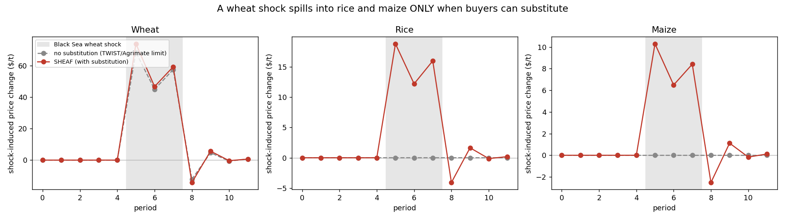

# SHEAF Model

<p align="center">
  
</p>

> **sheaf** &nbsp;/ʃiːf/&nbsp;
> — *(agriculture)* a bundle of cereal stalks bound together after the harvest;
> — *(mathematics)* a structure that consistently glues locally defined data into a coherent global whole (sheaf theory).
>
> Both senses describe the model. It **binds** several grains and heterogeneous agents into one
> trade network, and it **glues** each country's local supply, demand, and policy into a single,
> globally consistent market equilibrium.

**S**ubstitution, **H**eterogeneous agents, **E**quilibrium, **A**nd **F**ragility Model: a country-level,
multi-commodity, game-theoretic network model of global grain trade.

SHEAF couples three things that existing network trade models (e.g. PIK's TWIST,
Agrimate) treat only partially:

1. a **trade network** cleared by spatial price equilibrium,
2. **strategic government behavior** — exporters play an export-restriction game,
3. **cross-commodity substitution** — wheat, rice, and maize markets are linked on
   the demand side, so a shock to one grain spills into the others.

The third point is the reason SHEAF exists. Single-commodity strategic-trade
models wall each grain off from the others, and reviewers rightly object that this
overstates price spikes and misses the substitution margin. In SHEAF the
no-substitution case is a *special limit* of the model (set the cross-price terms
to zero), and the gap between that limit and the full model is itself a result.



*A Black Sea wheat shock, shown as the shock-induced price change (shocked minus a
no-shock counterfactual). Wheat jumps in both regimes. Rice and maize move **only**
when buyers can substitute; with substitution switched off they sit flat at zero —
the decoupled, single-commodity limit.*

## Mathematical formulation

SHEAF couples a **market layer** — a multi-commodity spatial price equilibrium that
clears the trade network — with a **strategic layer** in which exporting governments
choose export restrictions, and a **storage layer** that carries stocks between
periods. This section states the model precisely; it is written to match the
implementation in `sheaf/core.py` and to serve as a methods reference.

### Notation

| Symbol | Meaning |
|---|---|
| $i,j \in \{1,\dots,n\}$ | countries (network nodes) |
| $g,h \in \{1,\dots,G\}$ | grains (wheat, rice, maize) |
| $D_i \in \mathbb{R}^{G}_{\ge 0}$ | consumption vector of country $i$ |
| $a_i \in \mathbb{R}^{G}$ | demand intercept (choke consumption, i.e. demand at zero price) |
| $p_i \in \mathbb{R}^{G}$ | domestic price vector of country $i$ |
| $f^g_{ij} \ge 0$ | bilateral flow of grain $g$ from $i$ to $j$ |
| $Q^g_i$ | baseline production; $\xi^g_i$ production-shock multiplier |
| $A^g_i$ | available supply after storage |
| $M_i \in \mathbb{R}^{G\times G}$ | country $i$ demand-slope matrix (symmetric PD) |
| $D_{0},\ p_{0}$ | baseline consumption and reference prices (calibration anchors) |
| $\tau^g_i \ge 0$ | export-tax-equivalent (restriction); $m^g_j$ import tariff |
| $c_{ij},\ \phi_g,\ \psi_{ij}$ | transport cost, grain freight factor, route (chokepoint) multiplier |
| $R^g_i,\ \bar R^g_i$ | reserve (stock) level and storage capacity |
| $r,\ t$ | discount rate; time-period index |

### 1. Demand system (cross-commodity substitution)

Each country has a linear demand system over all grains, with **demand intercept**
$a_i\in\mathbb{R}^{G}$ (choke consumption, the demand at zero price) and slope matrix $M_i$,

$$D_i = a_i - M_i\, p_i, \qquad p_i = M_i^{-1}(a_i - D_i),$$

with $M_i$ **symmetric positive-definite**. Symmetry is the Slutsky/integrability
condition: it guarantees a scalar consumer-benefit potential $W_i$ whose gradient is
the inverse demand,

$$W_i(D_i) = (M_i^{-1} a_i)^\top D_i - \tfrac12\, D_i^\top M_i^{-1} D_i,
\qquad \nabla_{D_i} W_i = M_i^{-1}(a_i - D_i) = p_i,$$

and positive-definiteness makes $W_i$ **strictly concave** (since $M_i \succ 0 \iff
M_i^{-1}\succ 0$), which is what keeps the market program well-posed. Consumer
surplus is the potential net of expenditure,

$$CS_i(D_i) = W_i(D_i) - p_i^\top D_i,$$

which reduces to the familiar triangle $\tfrac12\sum_g (D^g_i)^2/\beta^g_i$ in the
one-grain, constant-slope case (with $\beta^g_i=b_g$, the own-price slope).

**Construction of $M_i$ from data.** Given baseline consumption $D_{0}$, reference
prices $p_{0}$, own-price elasticities $\varepsilon_g<0$, and a symmetric
substitutability matrix $\rho_{gh}\in[0,1)$ with zero diagonal, define own slopes
and cross terms

$$b_g = -\,\varepsilon_g\, \frac{D_{0,g}}{p_{0,g}} \;>\;0,
\qquad
S_{gh} = \sigma\,\rho_{gh}\,\sqrt{b_g b_h}\ \ (g\neq h),\quad S_{gg}=0,$$

$$M_i = \mathrm{diag}(b) - S \quad\text{(symmetrised)},\qquad
a_i = D_{0} + M_i\, p_{0}.$$

Here $\sigma \ge 0$ (`subst_scale`) is a global substitution strength. Off-diagonals
of $M_i$ are $-S_{gh}\le 0$, i.e. $\partial D^g_i/\partial p^h_i = -M_{i,gh} \ge 0$
for substitutes: a higher price of grain $h$ raises demand for grain $g$. Rows of
$S$ are rescaled if needed to enforce strict diagonal dominance, which guarantees
$M_i \succ 0$. The intercept calibration ensures $D_i = D_0$ at $p_i = p_0$.

### 2. Market layer: multi-commodity spatial price equilibrium

Given availabilities $A^g_i$ and policies $(\tau,m)$, all grains clear **jointly** as
one concave quadratic program (Samuelson–Takayama–Judge net-social-payoff form):

$$\max_{D\ge 0,\ f\ge 0}\ \ \sum_{i=1}^{n} W_i(D_i)\;-\;\sum_{g=1}^{G}\sum_{i,j} K^g_{ij}\, f^g_{ij}$$

$$\text{s.t.}\quad
A^g_i + \sum_{k} f^g_{ki} - \sum_{k} f^g_{ik} - D^g_i = 0 \quad \forall i,g,
\qquad f^g_{ii}=0,$$

where the delivered marginal cost on a route bundles transport and trade policy,

$$K^g_{ij} = c_{ij}\,\phi_g\,\psi_{ij} \;+\; \tau^g_i \;+\; m^g_j .$$

Commodities are coupled **only** through the off-diagonal (cross-price) terms of each
$W_i$; the network couples countries through the balance constraints and $K$.

**Equilibrium interpretation.** Let $\lambda^g_i$ be the multiplier on the balance
constraint. At the optimum $\lambda^g_i = p^g_i$ (the recovered domestic price), and
the KKT/complementary-slackness conditions are the classical spatial-arbitrage
(Enke–Samuelson) relations

$$p^g_j - p^g_i \le K^g_{ij}, \qquad f^g_{ij}\,\big(K^g_{ij} - (p^g_j - p^g_i)\big) = 0 .$$

Grain moves $i\to j$ only when the price gap exactly covers the delivered marginal
cost; an export tax $\tau^g_i$ raises every route out of $i$ and thus widens the wedge
between $i$'s domestic price and world prices — the mechanism of insulation. Strict
concavity of $\sum_i W_i$ gives a unique equilibrium consumption/price allocation
(flows may be non-unique when routes tie).

### 3. Storage layer

Two stock types adjust availability before clearing,
$A^g_i = Q^g_i\,\xi^g_i - \Delta^{\mathrm{mkt},g}_i - \Delta^{\mathrm{gov},g}_i$,
with $\Delta>0$ a build (removed from supply) and $\Delta<0$ a release. Expectations
are adaptive/mean-reverting toward a normal price $p^{\mathrm{norm}}_g$,

$$p^{e}_{i,g} = p^{\mathrm{prev}}_{i,g} + \kappa\,(p^{\mathrm{norm}}_g - p^{\mathrm{prev}}_{i,g}).$$

**Competitive (market-responsive) storage** follows a Wright–Williams / Deaton–Laroque
arbitrage rule with a carrying-cost deadband $\theta$: with signal
$s = p^{e}_{i,g}/(1+r) - p^{\mathrm{ref}}_{i,g}$, where the reference price
$p^{\mathrm{ref}}$ is the **previous period's** realised domestic price
$p^{\mathrm{prev}}$ (so private storage responds to a contemporaneous harvest
shock with a one-period lag — a disclosed prototype timing choice, not a
simultaneous TWIST/Agrimate-style rule),

$$\Delta^{\mathrm{mkt},g}_i =
\begin{cases}
\gamma^g_i\big(s - \theta\,\mathrm{sgn} s\big), & |s|>\theta,\\[2pt]
0, & |s|\le\theta,
\end{cases}
\qquad \text{clipped to } [-R^g_i,\ \bar R^g_i - R^g_i].$$

Stocks are built when the discounted expected price exceeds the current price by more
than the carrying cost, and released in the opposite case. Expectations mean-revert
toward a target chosen so the storage rule's rest point equals mean $p_0$
(not raw $p^{\mathrm{norm}}$).

**Strategic (government) buffer stocks** release in a crisis and rebuild toward a
target stock-to-use ratio $\vartheta^g_i$ in calm periods. The quantity-leg shortfall
is the **gap after normal baseline trade**
$\Sigma = D^g_{0,i} - A^{\text{(pre-gov)}} - \max(D^g_{0,i}-Q^g_i,\,0)$
(so structural importers are calm at $\xi=1$, and exporters enter crisis only when
pre-gov availability falls below domestic baseline needs), with trigger price
$p^{\mathrm{trig}}$,

$$\Delta^{\mathrm{gov},g}_i =
\begin{cases}
-\,\min\!\big(\eta_{\mathrm{rel}}\,R^g_i,\ \max(\Sigma,0)\big) \ \text{or}\ -\eta_{\mathrm{rel}}R^g_i, & \text{crisis } (p^{\mathrm{ref}}>p^{\mathrm{trig}} \ \text{or}\ \Sigma>0),\\[2pt]
+\,\eta_{\mathrm{bld}}\big(\vartheta^g_i D^g_{0,i} - R^g_i\big)_+, & \text{calm (and not crisis)}.
\end{cases}$$

### 4. Strategic layer: export-restriction game

Each exporting government chooses a non-negative export-tax-equivalent vector
$\tau_i = (\tau^g_i)_g$ (a ban corresponds to a large $\tau$) to maximise national
welfare, taking other governments' choices as given:

$$\mathcal{W}_i(\tau) = CS_i \;+\; \underbrace{\sum_g p_{i,g} Q_{i,g}}_{\text{producer income } \Pi_i}
\;-\; \underbrace{\sum_g w_{i,g}\,\big(p_{i,g}-\bar p_{i,g}\big)_+^{2}}_{\text{food-security penalty } \Phi_i}
\;+\; \zeta \underbrace{\sum_g \tau^g_i X^g_i}_{\text{terms-of-trade } \Psi_i},$$

where $(x)_+ = \max(x,0)$, $X^g_i$ is net exports, $w_{i,g}\ge 0$ weights the political
cost of high domestic staple prices, $\bar p_{i,g}$ is the tolerated price, and
$\zeta$ (`revenue_weight`, default $0$) optionally activates a terms-of-trade motive.
Producer income uses **baseline** production $Q$ (not shocked or post-storage sales) as a
fixed policy weight in $\Pi_i$ — intentional in this prototype, not realised farm receipts.
Crucially every term depends on $\tau$ through the market map $p(\tau), D(\tau), X(\tau)$
of §2. The one-sided quadratic penalty is flat until the domestic price breaches
$\bar p_{i,g}$ and convex above it, which reproduces the observed regime switch: trade
stays open in calm periods and restrictions appear only in price spikes.

A **Nash equilibrium** is a profile $\tau^\star$ with

$$\tau_i^\star \in \arg\max_{0\le \tau_i \le \bar\tau}\ \mathcal{W}_i\big(\tau_i, \tau_{-i}^\star\big)\quad \forall i .$$

It is computed by **iterated best response** over the equilibrium map: each exporter's
$\tau^g_i$ is line-searched on a grid $\{0,\dots,\bar\tau\}$ (re-solving the market QP
for every candidate), sweeping exporters until $\max_{i,g}|\tau^{(k+1)} - \tau^{(k)}|
< \epsilon$. Because $\mathcal{W}_i$ is non-concave in $\tau$ (the penalty kink,
the network), this returns an approximate/discretised equilibrium rather than a proven
unique one — standard for this class of policy games.

**Why states, not firms, are the strategic players.** The strategic instrument is an
export restriction — a sovereign lever no firm can pull — so the object of study fixes
the players. Agribusiness is not absent: the competitive market layer of §2 *is*
traders arbitraging price gaps across the network. The firm optimises within the
rules; the state sets them. Oligopolistic traders with market power are a natural
third agent class for future work, but for the export-ban question the first-order
driver is state policy.

### 5. Temporal dynamics

Each period $t$ executes: (i) form expectations $p^e$; (ii) set storage
$\Delta^{\mathrm{mkt}},\Delta^{\mathrm{gov}}$ and hence availability $A_t$;
(iii) a **stress gate** solves the market at $\tau=0$ and plays the game only if
$\max_{i,g} p_{i,g} > \mu\,p^{\mathrm{norm}}_g$ (calm periods have $\tau\approx 0$ regardless,
so this only saves computation); (iv) clear the market / equilibrium game to get
$p_t, D_t, f_t$; (v) update reserves $R_{t+1} = \max(0,\ R_t + \Delta_t)$ and carry
$p^{\mathrm{prev}} \leftarrow p_t$. Shocks enter as production multipliers
$\xi^g_i(t)$ and chokepoint disruptions as route multipliers $\psi_{ij}(t)$.

### 6. The single-commodity models as a limiting case

> **Proposition.** If $\sigma = 0$ (equivalently $\rho \equiv 0$), then $S = 0$ and
> each $M_i = \mathrm{diag}(b_i)$ is diagonal. The benefit potential separates,
> $W_i(D_i) = \sum_g W^g_i(D^g_i)$, so the market QP of §2 decomposes into $G$
> **independent** single-commodity spatial price equilibria, and national welfare
> $\mathcal{W}_i$ decouples across grains so the export game is played independently
> per grain. SHEAF then reduces to $G$ parallel single-commodity strategic-trade
> models of the TWIST/Agrimate class.

Consequently those models are the **zero-substitution boundary** of SHEAF, and the
substitution contribution is precisely the deviation from that boundary — the object
`demo.py` measures (a wheat shock spilling into rice and maize only when $\sigma>0$).

### 7. From data to parameters

**Intended production path** (VALIDATION.md): production $Q$, baseline consumption
$D_0$, and stocks $S_0$ from USDA PSD (`sheaf/data_usda.py`); reserves from USDA, not
FAOSTAT (FAOSTAT stocks are food-balance residuals); baseline network structure from
FAOSTAT bilateral matrices (`sheaf/data_faostat.py`).

**Current runnable prototype:** `demo.py` and `SheafModel` use the illustrative
hand-entered table in `sheaf/calibration.py`. The USDA/FAOSTAT adapters feed
diagnostic scripts (`scripts/validate_forcing.py`, `scripts/build_network.py`) and
are **not** yet wired into the live country list. Treat magnitudes as order-of-magnitude
illustrations, not estimates. Own- and cross-price elasticities
$(\varepsilon_g,\rho_{gh})$ are illustrative / literature-flavoured placeholders.
Policy parameters $(w_{i,g}, \bar p_{i,g})$ are hand-set for the prototype; fitting
them to historical restriction cascades is a **calibration** exercise (see
`VALIDATION.md` Level 2), not a completed out-of-sample prediction.

### References

*Spatial price equilibrium (market layer).*

- Enke, S. (1951). Equilibrium among spatially separated markets: solution by electric analogue. *Econometrica*, 19(1), 40–47. https://www.jstor.org/stable/1907907
- Samuelson, P. A. (1952). Spatial price equilibrium and linear programming. *American Economic Review*, 42, 283–303.
- Takayama, T., & Judge, G. G. (1971). *Spatial and Temporal Price and Allocation Models*. Amsterdam: North-Holland.

*Competitive storage (storage layer).*

- Wright, B. D., & Williams, J. C. (1982). The economic role of commodity storage. *The Economic Journal*, 92(367), 596–614. https://doi.org/10.2307/2232552
- Williams, J. C., & Wright, B. D. (1991). *Storage and Commodity Markets*. Cambridge: Cambridge University Press.
- Deaton, A., & Laroque, G. (1992). On the behaviour of commodity prices. *The Review of Economic Studies*, 59(1), 1–23. https://doi.org/10.2307/2297923

*Export restrictions and price insulation (strategic layer).*

- Headey, D. (2011). Rethinking the global food crisis: The role of trade shocks. *Food Policy*, 36(2), 136–146. https://doi.org/10.1016/j.foodpol.2010.10.003
- Martin, W., & Anderson, K. (2012). Export restrictions and price insulation during commodity price booms. *American Journal of Agricultural Economics*, 94(2), 422–427. https://doi.org/10.1093/ajae/aar105

*Food-trade networks and the crisis-modelling lineage (single-commodity predecessors SHEAF generalises).*

- Puma, M. J., Bose, S., Chon, S. Y., & Cook, B. I. (2015). Assessing the evolving fragility of the global food system. *Environmental Research Letters*, 10(2), 024007. https://doi.org/10.1088/1748-9326/10/2/024007
- Schewe, J., Otto, C., & Frieler, K. (2017). The role of storage dynamics in annual wheat prices. *Environmental Research Letters*, 12(5), 054005. — introduces the Trade With Storage (**TWIST**) model.
- Falkendal, T., Otto, C., Schewe, J., Jägermeyr, J., Konar, M., Kummu, M., Watkins, B., & Puma, M. J. (2021). Grain export restrictions during COVID-19 risk food insecurity in many low- and middle-income countries. *Nature Food*, 2(1), 11–14. https://doi.org/10.1038/s43016-020-00211-7
- Kuhla, K., Kubiczek, P., & Otto, C. (2025). Understanding agricultural market dynamics in times of crisis: the dynamic agent-based network model Agrimate. *Ecological Economics*, 231, 108546. https://doi.org/10.1016/j.ecolecon.2025.108546

*Note on the TWIST/Agrimate lineage.* TWIST (Trade With Storage; Schewe et al. 2017, applied in Falkendal et al. 2021) reproduces annual world wheat prices from a stylised price–supply curve but does not resolve the trade network; Agrimate (Kuhla et al. 2025) adds a dynamic agent-based network with commercial and strategic stockholding, hindcasting 2007/08 and 2010/11 for wheat. Both are single-commodity; SHEAF is the multi-commodity, substitution-aware generalisation with an endogenous export-restriction game (see §6, the zero-substitution limit).

## Quick start

```bash
pip install -r requirements.txt
python demo.py
```

The demo runs a Black Sea wheat shock (Russia −40%, Ukraine −50%) under two
regimes — substitution on (full SHEAF) and off (single-commodity limit) — plus a
no-shock counterfactual for each, and writes `sheaf_results.csv` and four figures.

Minimal use in code:

```python
from sheaf import build_countries, SheafModel

countries, transport, grains, freight = build_countries(substitution=True)
model = SheafModel(countries, transport, grains, freight_mult=freight)
df = model.run(periods=12, shocks={5: shock_matrix, 6: shock_matrix})
```

## Layout

```
sheaf/
  core.py          # demand system, spatial equilibrium, export game, storage, orchestrator
  calibration.py   # the 3-grain prototype dataset (swap this for real data)
demo.py            # Black Sea shock scenario + figures
figures/           # generated example figures
```

## Extending it

- **Grains** — the commodity dimension is an extensible list. Adding barley,
  sorghum, or rye is appending entries to `GRAINS`, `P0`, `OWN_ELAST`, the `RHO`
  substitution matrix, and per-country production/consumption — no re-architecting.
- **Real data** — replace `calibration.py`. Production and consumption from
  FAOSTAT / USDA PSD; the demand system takes baseline `(D0, p0, own_elast)` plus a
  substitutability matrix `rho`; validate baseline flows against BACI / COMTRADE.
- **Chokepoints** — `route_multiplier` scales the cost of a corridor, so a
  Bosphorus / Bab-el-Mandeb / Hormuz disruption enters the same machinery as a
  production shock.
- **Terms-of-trade motive** — `ExportRestrictionGame(revenue_weight=…)` adds an
  export-tax-revenue term; with substitution on, a flatter residual demand curve
  changes the optimal restriction, an interaction unavailable to no-substitution
  or no-strategy models.

## Caveats

This is a **prototype**. The calibration numbers are order-of-magnitude realistic
but illustrative — do not read the magnitudes as estimates. Demand and supply are
linear (roughly ~15% global glut headroom before inverse-demand prices can go
negative; no free disposal), production is short-run inelastic within a period, and
Nash is an iterated-best-response approximation on a **coarse** default tax grid
(`game_grid=5`). Private storage uses lagged prices by design. It implements the
*architecture*, not a line-for-line replica of any published model's equations, and
does not yet execute the Level-1/2 crisis hindcasts described in `VALIDATION.md`.

## License

MIT — see `LICENSE`.
