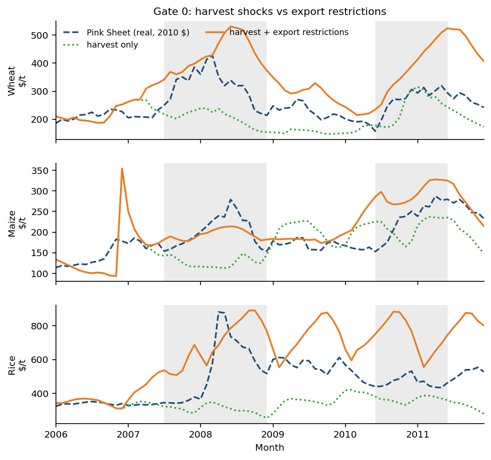

# SHEAF Model

<p align="center">
  
</p>

> **sheaf** &nbsp;/ʃiːf/&nbsp;
> — *(agriculture)* a bundle of cereal stalks bound together after the harvest;
> — *(mathematics)* a structure that consistently glues locally defined data into a coherent global whole (sheaf theory).
>
> Both senses describe the model. It **binds** several grains and heterogeneous agents into one
> trade network, and it **glues** each country's local supply, demand, and policy into a single,
> globally consistent market equilibrium.

**S**ubstitution, **H**eterogeneous agents, **E**quilibrium, **A**nd **F**ragility Model: a country-level,
multi-commodity, game-theoretic network model of global grain trade.

It sits in the TWIST → Agrimate lineage. Those models already do storage (and Agrimate
already does a trade network). SHEAF exists because two first-order pieces of crisis
dynamics are still missing:

1. **Strategy.** Exporters restrict in a crisis, and those restrictions move world
   prices. Agrimate takes the restriction schedule as given (AMIS). SHEAF's destination
   is an *endogenous* export-restriction game among governments — who restricts, how
   much, and whether cooperation changes the outcome. Gate 0 first isolates that
   contribution with AMIS prescribed, one crop at a time.
2. **Substitution.** Wheat, rice, and maize are linked on the demand side, so a shock
   to one grain spills into the others. Single-commodity models wall each grain off;
   that overstates own-grain spikes and misses the other markets. In SHEAF the
   no-substitution case is a *special limit* (`σ = 0`), not the model.

Both sit on a **trade network** cleared each **fortnight** (Gate 0: 24
steps/year). Crisis papers keep substitution and the game as separate
switches: Gate 0 is both off (AMIS diary); Gate 1 is substitution on,
game off; the crisis game is types slow / actions on that same 24-step
clock (`diagnostics/GAME_CLOCK.md`). Headey (2011) is the guiding
account of why those actions have dates, not marketing years. The
annual SPE in `sheaf/core.py` is a leftover prototype from when the
market itself was annual (TWIST). It is still run by `demo.py`. It is
**not** the 2007/08 object and **not** a reason to re-run Gate 0 or
Gate 1.



*Gate 0, 2006–11, one crop at a time (Pink Sheet in real 2010 \$). Harvest anomalies
alone miss the 2008 rice spike and understate 2007/08 wheat; adding observed export
restrictions (AMIS) produces both. That is why SHEAF has a strategic layer —
restrictions are first-order, not a residual. Agrimate takes those restrictions as
given; SHEAF's next step is to let exporters choose them **on that same
two-week clock**. Characteristic government types (how much they care
about domestic food) can be sticky; the decision is not. Substitution is
the other missing piece, and is still off in this figure. Gate 0 does
not need to be re-run to say that.

## Mathematical formulation

SHEAF has two related formulations. **Crisis work uses (2).**

1. **Annual multi-commodity SPE + export game** (`sheaf/core.py`, §§1–6) —
   the original TWIST-era market / strategic / storage layers. One tax per
   year, node prices from a Takayama–Judge QP. `demo.py` still runs this.
   It is a prototype, not the crisis game.
2. **Gate 0 per-crop sub-annual spine** (`sheaf/dynamic_crop.py`, §8) —
   Agrimate-aligned 24-step/year bilateral stock–trade dynamics with
   **ask-dominated** world prices. Harvest forcing is climatology ×
   **LOWESS anomaly**. Gate 1 puts isoelastic substitution on this spine.
   Gate 2 puts **state-contingent** export cuts on this spine
   (`sheaf/dynamic_policy.py`): types are slow, actions `τ_t` respond to
   conditions (Headey 2011). Two players share a type (Russia harvest
   shock, Kazakhstan neighbor); the cascade is harvest diversion, not
   ban-on-ban IBR. Clock lock: `diagnostics/GAME_CLOCK.md`.

   Run wheat, maize, and rice **separately** first
   (`scripts/score_subannual_crop.py --crop …`). Those official P1
   scores are frozen; Headey is not a reason to re-run them.

Crisis validation (Gate 0) uses §8 with AMIS prescribed and the game
**off**. The annual SPE is a reference / outer diagnostic, not the
Level-2 host.

### Notation (annual SPE layers, §§1–5)

| Symbol | Meaning |
|---|---|
| $i,j \in \{1,\dots,n\}$ | countries (network nodes) |
| $g,h \in \{1,\dots,G\}$ | grains (wheat, rice, maize) |
| $D_i \in \mathbb{R}^{G}_{\ge 0}$ | consumption vector of country $i$ |
| $a_i \in \mathbb{R}^{G}$ | demand intercept (choke consumption, i.e. demand at zero price) |
| $p_i \in \mathbb{R}^{G}$ | domestic price vector of country $i$ |
| $f^g_{ij} \ge 0$ | bilateral flow of grain $g$ from $i$ to $j$ |
| $Q^g_i$ | baseline production; $\xi^g_i$ production-shock multiplier |
| $A^g_i$ | available supply after storage |
| $M_i \in \mathbb{R}^{G\times G}$ | country $i$ demand-slope matrix (symmetric PD) |
| $D_{0},\ p_{0}$ | baseline consumption and reference prices (calibration anchors) |
| $\tau^g_i \ge 0$ | export-tax-equivalent (restriction); $m^g_j$ import tariff |
| $c_{ij},\ \phi_g,\ \psi_{ij}$ | transport cost, grain freight factor, route (chokepoint) multiplier |
| $R^g_i,\ \bar R^g_i$ | reserve (stock) level and storage capacity |
| $r,\ t$ | discount rate; time-period index |

### 1. Demand system (cross-commodity substitution)

Each country has a linear demand system over all grains, with **demand intercept**
$a_i\in\mathbb{R}^{G}$ (choke consumption, the demand at zero price) and slope matrix $M_i$,

$$D_i = a_i - M_i\, p_i, \qquad p_i = M_i^{-1}(a_i - D_i),$$

with $M_i$ **symmetric positive-definite**. Symmetry is the Slutsky/integrability
condition: it guarantees a scalar consumer-benefit potential $W_i$ whose gradient is
the inverse demand,

$$W_i(D_i) = (M_i^{-1} a_i)^\top D_i - \tfrac12\, D_i^\top M_i^{-1} D_i,
\qquad \nabla_{D_i} W_i = M_i^{-1}(a_i - D_i) = p_i,$$

and positive-definiteness makes $W_i$ **strictly concave** (since $M_i \succ 0 \iff
M_i^{-1}\succ 0$), which is what keeps the market program well-posed. Consumer
surplus is the potential net of expenditure,

$$CS_i(D_i) = W_i(D_i) - p_i^\top D_i,$$

which reduces to the familiar triangle $\tfrac12\sum_g (D^g_i)^2/\beta^g_i$ in the
one-grain, constant-slope case (with $\beta^g_i=b_g$, the own-price slope).

**Construction of $M_i$ from data.** Given baseline consumption $D_{0}$, reference
prices $p_{0}$, own-price elasticities $\varepsilon_g<0$, and a symmetric
substitutability matrix $\rho_{gh}\in[0,1)$ with zero diagonal, define own slopes
and cross terms

$$b_g = -\,\varepsilon_g\, \frac{D_{0,g}}{p_{0,g}} \;>\;0,
\qquad
S_{gh} = \sigma\,\rho_{gh}\,\sqrt{b_g b_h}\ \ (g\neq h),\quad S_{gg}=0,$$

$$M_i = \mathrm{diag}(b) - S \quad\text{(symmetrised)},\qquad
a_i = D_{0} + M_i\, p_{0}.$$

Here $\sigma \ge 0$ (`subst_scale`) is a global substitution strength. Off-diagonals
of $M_i$ are $-S_{gh}\le 0$, i.e. $\partial D^g_i/\partial p^h_i = -M_{i,gh} \ge 0$
for substitutes: a higher price of grain $h$ raises demand for grain $g$. Rows of
$S$ are rescaled if needed to enforce strict diagonal dominance, which guarantees
$M_i \succ 0$. The intercept calibration ensures $D_i = D_0$ at $p_i = p_0$.

### 2. Market layer: multi-commodity spatial price equilibrium

Given availabilities $A^g_i$ and policies $(\tau,m)$, all grains clear **jointly** as
one concave quadratic program (Samuelson–Takayama–Judge net-social-payoff form):

$$\max_{D\ge 0,\ f\ge 0}\ \ \sum_{i=1}^{n} W_i(D_i)\;-\;\sum_{g=1}^{G}\sum_{i,j} K^g_{ij}\, f^g_{ij}$$

$$\text{s.t.}\quad
A^g_i + \sum_{k} f^g_{ki} - \sum_{k} f^g_{ik} - D^g_i = 0 \quad \forall i,g,
\qquad f^g_{ii}=0,$$

where the delivered marginal cost on a route bundles transport and trade policy,

$$K^g_{ij} = c_{ij}\,\phi_g\,\psi_{ij} \;+\; \tau^g_i \;+\; m^g_j .$$

Commodities are coupled **only** through the off-diagonal (cross-price) terms of each
$W_i$; the network couples countries through the balance constraints and $K$.

**Equilibrium interpretation.** Let $\lambda^g_i$ be the multiplier on the balance
constraint. At the optimum $\lambda^g_i = p^g_i$ (the recovered domestic price), and
the KKT/complementary-slackness conditions are the classical spatial-arbitrage
(Enke–Samuelson) relations

$$p^g_j - p^g_i \le K^g_{ij}, \qquad f^g_{ij}\,\big(K^g_{ij} - (p^g_j - p^g_i)\big) = 0 .$$

Grain moves $i\to j$ only when the price gap exactly covers the delivered marginal
cost; an export tax $\tau^g_i$ raises every route out of $i$ and thus widens the wedge
between $i$'s domestic price and world prices — the mechanism of insulation. Strict
concavity of $\sum_i W_i$ gives a unique equilibrium consumption/price allocation
(flows may be non-unique when routes tie).

### 3. Storage layer

Two stock types adjust availability before clearing,
$A^g_i = Q^g_i\,\xi^g_i - \Delta^{\mathrm{mkt},g}_i - \Delta^{\mathrm{gov},g}_i$,
with $\Delta>0$ a build (removed from supply) and $\Delta<0$ a release. Expectations
are adaptive/mean-reverting toward a normal price $p^{\mathrm{norm}}_g$,

$$p^{e}_{i,g} = p^{\mathrm{prev}}_{i,g} + \kappa\,(p^{\mathrm{norm}}_g - p^{\mathrm{prev}}_{i,g}).$$

**Competitive (market-responsive) storage** follows a Wright–Williams / Deaton–Laroque
arbitrage rule with a carrying-cost deadband $\theta$: with signal
$s = p^{e}_{i,g}/(1+r) - p^{\mathrm{ref}}_{i,g}$, where the reference price
$p^{\mathrm{ref}}$ is the **previous period's** realised domestic price
$p^{\mathrm{prev}}$ (so private storage responds to a contemporaneous harvest
shock with a one-period lag — a disclosed prototype timing choice, not a
simultaneous TWIST/Agrimate-style rule),

$$\Delta^{\mathrm{mkt},g}_i =
\begin{cases}
\gamma^g_i\big(s - \theta\,\mathrm{sgn} s\big), & |s|>\theta,\\[2pt]
0, & |s|\le\theta,
\end{cases}
\qquad \text{clipped to } [-R^g_i,\ \bar R^g_i - R^g_i].$$

Stocks are built when the discounted expected price exceeds the current price by more
than the carrying cost, and released in the opposite case. Expectations mean-revert
toward a target chosen so the storage rule's rest point equals mean $p_0$
(not raw $p^{\mathrm{norm}}$).

**Strategic (government) buffer stocks** release in a crisis and rebuild toward a
target stock-to-use ratio $\vartheta^g_i$ in calm periods. The quantity-leg shortfall
is the **gap after normal baseline trade**
$\Sigma = D^g_{0,i} - A^{\text{(pre-gov)}} - \max(D^g_{0,i}-Q^g_i,\,0)$
(so structural importers are calm at $\xi=1$, and exporters enter crisis only when
pre-gov availability falls below domestic baseline needs), with trigger price
$p^{\mathrm{trig}}$,

$$\Delta^{\mathrm{gov},g}_i =
\begin{cases}
-\,\min\!\big(\eta_{\mathrm{rel}}\,R^g_i,\ \max(\Sigma,0)\big) \ \text{or}\ -\eta_{\mathrm{rel}}R^g_i, & \text{crisis } (p^{\mathrm{ref}}>p^{\mathrm{trig}} \ \text{or}\ \Sigma>0),\\[2pt]
+\,\eta_{\mathrm{bld}}\big(\vartheta^g_i D^g_{0,i} - R^g_i\big)_+, & \text{calm (and not crisis)}.
\end{cases}$$

### 4. Strategic layer: export-restriction game

> **Crisis clock (Headey 2011).** Governments in 2007/08 did not pick one
> tax for a marketing year. India and Vietnam restricted rice in October;
> Thailand *discussed* a ban in March 2008; Japan’s May stock-release
> *announcement* (the grain reportedly never shipped) is credited with
> turning prices. Types can be sticky. Actions are sub-annual. The live
> layer is `sheaf/dynamic_policy.py` on the Gate 0 spine
> (`diagnostics/GAME_CLOCK.md`). The annual Nash below is the leftover
> prototype in `sheaf/core.py`.

Each exporting government in the **annual prototype** chooses a
non-negative export-tax-equivalent vector
$\tau_i = (\tau^g_i)_g$ (a ban corresponds to a large $\tau$) to maximise national
welfare, taking other governments' choices as given:

$$\mathcal{W}_i(\tau) = CS_i \;+\; \underbrace{\sum_g p_{i,g} Q_{i,g}}_{\text{producer income } \Pi_i}
\;-\; \underbrace{\sum_g w_{i,g}\,\big(p_{i,g}-\bar p_{i,g}\big)_+^{2}}_{\text{food-security penalty } \Phi_i}
\;+\; \zeta \underbrace{\sum_g \tau^g_i X^g_i}_{\text{terms-of-trade } \Psi_i},$$

where $(x)_+ = \max(x,0)$, $X^g_i$ is net exports, $w_{i,g}\ge 0$ weights the political
cost of high domestic staple prices, $\bar p_{i,g}$ is the tolerated price, and
$\zeta$ (`revenue_weight`, default $0$) optionally activates a terms-of-trade motive.
Producer income uses **baseline** production $Q$ (not shocked or post-storage sales) as a
fixed policy weight in $\Pi_i$ — intentional in this prototype, not realised farm receipts.
Crucially every term depends on $\tau$ through the market map $p(\tau), D(\tau), X(\tau)$
of §2. The one-sided quadratic penalty is flat until the domestic price breaches
$\bar p_{i,g}$ and convex above it, which reproduces the observed regime switch: trade
stays open in calm periods and restrictions appear only in price spikes.

A **Nash equilibrium** is a profile $\tau^\star$ with

$$\tau_i^\star \in \arg\max_{0\le \tau_i \le \bar\tau}\ \mathcal{W}_i\big(\tau_i, \tau_{-i}^\star\big)\quad \forall i .$$

It is computed by **iterated best response** over the equilibrium map: each exporter's
$\tau^g_i$ is line-searched on a grid $\{0,\dots,\bar\tau\}$ (re-solving the market QP
for every candidate), sweeping exporters until $\max_{i,g}|\tau^{(k+1)} - \tau^{(k)}|
< \epsilon$. Because $\mathcal{W}_i$ is non-concave in $\tau$ (the penalty kink,
the network), this returns an approximate/discretised equilibrium rather than a proven
unique one — standard for this class of policy games.

**Why states, not firms, are the strategic players.** The strategic instrument is an
export restriction — a sovereign lever no firm can pull — so the object of study fixes
the players. Agribusiness is not absent: the competitive market layer of §2 *is*
traders arbitraging price gaps across the network. The firm optimises within the
rules; the state sets them. Oligopolistic traders with market power are a natural
third agent class for future work, but for the export-ban question the first-order
driver is state policy.

### 5. Temporal dynamics (annual SPE orchestrator)

Each **annual** period $t$ in `SheafModel` executes: (i) form expectations $p^e$;
(ii) set storage $\Delta^{\mathrm{mkt}},\Delta^{\mathrm{gov}}$ and hence availability
$A_t$; (iii) a **stress gate** solves the market at $\tau=0$ and plays the game only
if $\max_{i,g} p_{i,g} > \mu\,p^{\mathrm{norm}}_g$; (iv) clear the market / equilibrium
game to get $p_t, D_t, f_t$; (v) update reserves
$R_{t+1} = \max(0,\ R_t + \Delta_t)$. Shocks enter as $\xi^g_i(t)$ and chokepoint
multipliers $\psi_{ij}(t)$.

**Gate 0 crisis hindcasts do not use this annual clock.** They use the 24-step/year
spine in §8 (`ARCHITECTURE.md`). **The crisis game does not use it either.**
Types stay slow; `τ_{i,t}` lives on that spine (`diagnostics/GAME_CLOCK.md`).
Do not re-run Gate 0 or Gate 1 because this paragraph changed.

### 6. The single-commodity models as a limiting case

> **Proposition.** If $\sigma = 0$ (equivalently $\rho \equiv 0$), then $S = 0$ and
> each $M_i = \mathrm{diag}(b_i)$ is diagonal. The benefit potential separates,
> $W_i(D_i) = \sum_g W^g_i(D^g_i)$, so the market QP of §2 decomposes into $G$
> **independent** single-commodity spatial price equilibria, and national welfare
> $\mathcal{W}_i$ decouples across grains so the export game is played independently
> per grain. SHEAF then reduces to $G$ parallel single-commodity strategic-trade
> models of the TWIST/Agrimate class.

Consequently those models are the **zero-substitution boundary** of SHEAF, and the
substitution contribution is precisely the deviation from that boundary — the object
`demo.py` measures (a wheat shock spilling into rice and maize only when $\sigma>0$).

### 7. From data to parameters

**Gate 0 wheat spine (§8):** USDA PSD country production, consumption, and ending
stocks (`sheaf/data_usda.py`); FAOSTAT bilateral E0 shares
(`sheaf/data_faostat.py`); AMIS export-restriction schedules; harvest calendars in
`data/crop_calendars/`; monthly Pink Sheet prices for scoring.

**Annual SPE prototype:** `demo.py` / `SheafModel` still use the illustrative table
in `sheaf/calibration.py` (optionally overlaid with USDA quantities). Own- and
cross-price elasticities $(\varepsilon_g,\rho_{gh})$ and policy weights
$(w_{i,g}, \bar p_{i,g})$ remain illustrative pending Level-2 calibration
(`VALIDATION.md`).

### 8. Gate 0 sub-annual crop spine (Agrimate-aligned)

Implementation: `sheaf/dynamic_crop.py` (wheat wrap: `sheaf/dynamic_wheat.py`).
Clock: $T_y=24$ steps per year
($\Delta t \approx 15.2$ days). Quantities in million tonnes (MMT); prices in
real \$/tonne (Pink Sheet deflator). **One crop at a time** until Gate 0 is green
for wheat, maize, and rice (`diagnostics/GATE0_PER_CROP_PLAN.md`).

#### Notation

| Symbol | Meaning | Default / source |
|---|---|---|
| $i,j$ | SHEAF nodes (17 named + Rest-of-World) | `calibration.DATA` |
| $t$ | sub-annual step index | $24$ per calendar year |
| $H_{i,t}$ | harvest inflow (MMT/step) | climatology × LOWESS anomaly × calendar |
| $C_{i,t}$ | baseline food use (MMT/step) | PSD consumption $/24$ |
| $S_{i,t}$ | end-of-step stocks (MMT) | state variable |
| $\mathrm{avail}_{i,t}$ | $S_{i,t}+H_{i,t}$ | — |
| $p_t$ | world price (\$/t) | state; smoothed |
| $p_0$ | reference price | mean real Pink Sheet in start year |
| $\varepsilon$ | food demand price elasticity | crop-specific (`CropParams.elast`) |
| $\tau_{i,t}\in[0,1]$ | AMIS export quantity cut | ban $0.95$, tax $0.50$, … |
| $A_{ij}$ | destination share of $i$'s exports to $j$ | FAOSTAT E0 (diag $0$) |
| $S_{ij}$ | source share of $j$'s imports from $i$ | FAOSTAT E0 (diag $0$) |
| $q_{i,t}$ | exporter **ask** price (\$/t) | adapts to fill rates |
| $\lambda$ | stock-rebuild speed per step | $0.08$ |
| $\phi$ | weight on realized harvest in foresight | $0.55$ (maize $0.40$) |
| $\eta$ | scarcity-price inverse elasticity | $\approx 1.0$ |
| $\rho$ | price smoothing toward $p^\star$ | $0.65$ |
| $\kappa_u,\kappa_b$ | unmet-anomaly and preferred-block weights | crop-specific |
| $\alpha,\theta$ | ask-adjustment speed and target fill | $0.15$, $0.70$ |
| $\alpha_r$ | rival-block ask markup | $0.80$ |
| $\gamma$ | ask competitiveness exponent | $1.25$ |
| $\omega$ | weight on trade-weighted ask in $p^\star$ | $\approx 0.65$–$0.72$ |
| $\beta$ | ask mean-reversion weight toward $p_t$ | $0.18$ |
| $\nu$ | residual-substitution share after Armington | $0.15$ |
| $s_i$ | safety stock | $\mathtt{stu\_target}\cdot C_i^{\mathrm{ann}}$ |
| $C^{\mathrm{flex}},C^{\mathrm{ind}}$ | price-elastic use vs inelastic industrial | USA maize: FSI excess vs 2000–04 |

Full parameterization, classes (structural / literature / reduced-form), and
economic defensibility: [`diagnostics/GATE0_PARAMETERIZATION.md`](diagnostics/GATE0_PARAMETERIZATION.md).
Defaults live in `sheaf.dynamic_crop.default_crop_params`.

#### Harvest calendars and why we detrend

The twin / climatology path is the score-window **mean** seasonal harvest
(country calendar weights in `sheaf/seasonal.py`). Treatment harvest is **not**
raw PSD year totals laid on that calendar. It is
$$
H_{i,y}^{\mathrm{ann}}=\overline{H}_i\cdot(1+a_{i,y}),
\qquad
a_{i,y}=\frac{Y_{i,y}-\hat Y_{i,y}}{\hat Y_{i,y}},
$$
where \(\hat Y\) is a per-country LOWESS trend on a padded PSD history
(`detrend_anomalies` in `sheaf/data_usda.py`, Agrimate's method) and the
annual total is then spread with triangular month weights.

**Why this matters.** An in-sample 2006–11 *mean* is contaminated by post-2008
trend growth. World wheat 2006 is about **−9% vs that mean** but only **−4% vs
LOWESS**. The model then treats 2006/07 as a crash (false May spike) and
under-weights 2010 (Russia drought sits near a boom-inflated mean). The same
bias made 2008 maize look scarce when it is on-trend, and dumped 2008–11 rice
growth into stocks. Signed anomalies vs trend keep the twin balanced with mean
flex demand and isolate *shocks*, not secular yield growth.

Official P1 still uses year-by-year AMIS and (for USA maize) industrial use;
only the harvest *level* is climatology × anomaly. `shock_mode=full` keeps
surpluses as well as shortfalls.

Rice calendars are multi-crop (kharif + rabi / early + late) except Vietnam,
whose autumn pulse is kept so the 2008 ban still hits offers.

#### Lean foresight and targets

Let $h_t$ be steps to the next global harvest pulse (cumulative future world
harvest $\ge 12\%$ of mean annual world $H$). Expected harvest for foresight is
the blend
$$H^{\mathrm{exp}}_{i,t}=\phi\,H_{i,t}+(1-\phi)\,H^{\mathrm{seas}}_{i,t},$$
where $H^{\mathrm{seas}}$ is the mean-year seasonal path. Then
$$
L_{i,t}=\max\Bigl(0,\ \sum_{k=1}^{h_t} C_{i,t+k}-\sum_{k=1}^{h_t} H^{\mathrm{exp}}_{i,t+k}\Bigr),
\qquad
T_{i,t}=L_{i,t}+s_i.
$$

#### Demand, offers, and AMIS

$$
d_{i,t}=C^{\mathrm{flex}}_{i,t}\,(p_t/p_0)^{\varepsilon}+C^{\mathrm{ind}}_{i,t},
$$
$$
D_{i,t}=\max(0,d_{i,t}-\mathrm{avail}_{i,t})
+\lambda\max\bigl(0,\,T_{i,t}-\max(0,\mathrm{avail}_{i,t}-d_{i,t})\bigr),
$$
$$
O_{i,t}=\max(0,\mathrm{avail}_{i,t}-d_{i,t}-T_{i,t})\,(1-\tau_{i,t}).
$$
Carry capacity is
$$
W_{i,t}=\mathtt{max\_stu}\,C_i^{\mathrm{ann}}
+\mathtt{pipeline\_max\_steps}\cdot C_i^{\mathrm{ann}}/24
+\mathbf{1}_{\{\mathtt{pipeline}>0\}}H_{i,t}.
$$
Pulse crops (wheat/maize, `pipeline_max_steps=12`) pad \(W\) with same-step
harvest so a pulse is not incinerated on intake. Rice (`pipeline=0`) clips
toward carry: padding \(W\) with every monsoon step stored harvest as silos.
Overflow is soft-clipped at `warehouse_lambda` (default = rebuild \(\lambda\)).

**Stock scoring (nodes, not groupings).** USDA PSD ending stocks are *local
marketing-year* carry. World wheat is scored in May (×1.02 vs PSD) and maize in
August (×1.08). Rice is August (×1.05), not calendar December — December is the
post-kharif peak and was the old ×1.63 “fat STU.” Each SHEAF node is then
scored at its own USDA MY-end month (`sheaf/marketing_years.py`). Do not
aggregate into Agrimate’s 28 regions. World tightness is also scored
FAO/AMIS-style: the same MY-end month **with and without China** (rice: also
without India). Wheat ×1.09 and rice ×1.14 excluding China sit next to the
including-China world bar; maize ×1.49 is leftover (China MY is September,
world bar is August, and local-MY China maize is fat). China remains a named
node; its stock *levels* are estimated state reserves and are not a Gate 0 fail.

**Consumption scoring (P1 expansion, not Agrimate Fig. 4).** World calendar-year
use vs **country-sum** PSD (not `load_crop_world`, which omits the EU): wheat
×0.92, maize ×0.92, rice ×0.86. Official matched is mean flex + isoelastic, so
the model path is flat/down while PSD use rises (wheat corr −0.17, maize −0.64,
rice −0.74). Median country-year ratio is a sanity print, not the bar.
Year-by-year food/feed is a sensitivity. Agrimate Fig. 4 scored supply Δ and
stock Δ, not consumption levels.

**AMIS shipment signs (P1 expansion).** Official matched vs harvest-only, not
the isolated-τ assert. τ cuts offers; shipments are demand-constrained.
Russia Aug–Dec 2010 offers ×0.11, ships ×0.79. Argentina May 2007 offers
×0.30, ships ×0.99. Rice Oct–Dec 2007 ban+harvest signs are right; the
scored Vietnam window is a 2008 tax. Not FAOSTAT bilateral crisis volumes.

#### Adaptive ask prices and Armington clear

Destination shares are ask-reweighted,
$$\tilde A_{ij}\propto A_{ij}\,(p_0/q_{i,t})^{\gamma}\quad(\text{rows renormed}),$$
then
$$\mathrm{ship}_{ij}=\min\bigl(O_{i,t}\tilde A_{ij},\,D_{j,t}S_{ij}\bigr),$$
with a residual pool that can fill at most fraction $\nu$ of leftover demand.
Fill rates update asks (sold-out $\Rightarrow$ raise ask; leftover $\Rightarrow$ cut):
$$
q_{i,t+1}
=\bigl[(1-\beta)\,q_{i,t}\exp\bigl(\alpha(\mathrm{fill}_{i,t}-\theta)
+\alpha_r b_t\cdot\mathbf{1}_{O_{i,t}>0}\bigr)
+\beta\,p_t\bigr],
\qquad
\mathrm{fill}_{i,t}=\frac{\sum_j\mathrm{ship}_{ij}}{\max(O_{i,t},\epsilon)},
$$
with mean-reversion weight $\beta=0.18$, rival markup \(\alpha_r=0.80\),
clipped to $[0.45\,p_0,\,2.8\,p_0]$. \(b_t\) is the preferred-source block
fraction; \(\alpha_r=0\) recovers the own-fill law.

#### World price

After trade, physical cover is \(\sum_i S_{i,t+1}-\sum_i L_{i,t}\). Surplus
sitting behind an export cut is not world-market accessible:
\(\mathrm{locked}_t=\sum_i \tau_{i,t}\max(0,S_{i,t+1}-T_{i,t})\),
\(\mathrm{free}_t=\sum_i S_{i,t+1}-\sum_i L_{i,t}-\mathrm{locked}_t\).
Let $F^{\mathrm{twin}}_t$ and $u^{\mathrm{twin}}_t$ be free stocks and unmet fractions
from a **path-matched twin** (mean flex $C$, mean-year $H$, no industrial, $\tau\equiv 0$). Define
$$
u_t=1-\frac{\sum_i\mathrm{received}_{i,t}}{\max(\sum_i D_{i,t},\epsilon)},
\quad
b_t=\frac{\sum_{i,j} S_{ij}\,\tau_{i,t}\,D_{j,t}}{\max(\sum_j D_{j,t},\epsilon)},
\quad
\Delta u_t=\max(0,u_t-u^{\mathrm{twin}}_t).
$$
Trade-weighted ask $p^{\mathrm{tr}}_t=\sum_i q_{i,t}\mathrm{shipped}_{i,t}/\sum_i\mathrm{shipped}_{i,t}$
(or $p_t$ if no trade). Scarcity signal
$$
p^{\mathrm{scar}}_t=p_0\cdot r_t^{\eta_{\mathrm{eff}}}
\cdot\bigl(1+\kappa_u\Delta u_t+\kappa_b b_t\bigr),
$$
with $r_t=(F^{\mathrm{twin}}_t+f)/(\mathrm{free}_t+f)$ and $\eta_{\mathrm{eff}}=\eta$
(symmetric in surplus and shortage). Then
$$
p^\star_t=\omega\,p^{\mathrm{tr}}_t+(1-\omega)\,p^{\mathrm{scar}}_t,
\qquad
p_t=\rho\,p_{t-1}+(1-\rho)\,p^\star_t.
$$
If the path matches the twin (calm), $p^\star_t=p_0$ by construction
(`assert_twin_identity`).

#### Robustness asserts

`assert_twin_identity`, `assert_amis_raises_price`, `assert_amis_cuts_exports`,
`assert_no_spring_spike` — run by `scripts/score_subannual_crop.py --crop …`.
Questions the model might answer (hindcast, substitution, who restricts,
club, tipping, network) — not a queue of papers:
`diagnostics/PAPER_STACK.md`. Clock: `diagnostics/GAME_CLOCK.md`.
Agrimate-style figures: `python scripts/make_agrimate_comparison.py`.

### References

*Spatial price equilibrium (market layer).*

- Enke, S. (1951). Equilibrium among spatially separated markets: solution by electric analogue. *Econometrica*, 19(1), 40–47. https://www.jstor.org/stable/1907907
- Samuelson, P. A. (1952). Spatial price equilibrium and linear programming. *American Economic Review*, 42, 283–303.
- Takayama, T., & Judge, G. G. (1971). *Spatial and Temporal Price and Allocation Models*. Amsterdam: North-Holland.

*Competitive storage (storage layer).*

- Wright, B. D., & Williams, J. C. (1982). The economic role of commodity storage. *The Economic Journal*, 92(367), 596–614. https://doi.org/10.2307/2232552
- Williams, J. C., & Wright, B. D. (1991). *Storage and Commodity Markets*. Cambridge: Cambridge University Press.
- Deaton, A., & Laroque, G. (1992). On the behaviour of commodity prices. *The Review of Economic Studies*, 59(1), 1–23. https://doi.org/10.2307/2297923

*Export restrictions and price insulation (strategic layer).*

- Headey, D. (2011). Rethinking the global food crisis: The role of trade shocks. *Food Policy*, 36(2), 136–146. https://doi.org/10.1016/j.foodpol.2010.10.003
- Martin, W., & Anderson, K. (2012). Export restrictions and price insulation during commodity price booms. *American Journal of Agricultural Economics*, 94(2), 422–427. https://doi.org/10.1093/ajae/aar105

*Food-trade networks and the crisis-modelling lineage (single-commodity predecessors SHEAF generalises).*

- Puma, M. J., Bose, S., Chon, S. Y., & Cook, B. I. (2015). Assessing the evolving fragility of the global food system. *Environmental Research Letters*, 10(2), 024007. https://doi.org/10.1088/1748-9326/10/2/024007
- Schewe, J., Otto, C., & Frieler, K. (2017). The role of storage dynamics in annual wheat prices. *Environmental Research Letters*, 12(5), 054005. — introduces the Trade With Storage (**TWIST**) model.
- Falkendal, T., Otto, C., Schewe, J., Jägermeyr, J., Konar, M., Kummu, M., Watkins, B., & Puma, M. J. (2021). Grain export restrictions during COVID-19 risk food insecurity in many low- and middle-income countries. *Nature Food*, 2(1), 11–14. https://doi.org/10.1038/s43016-020-00211-7
- Kuhla, K., Kubiczek, P., & Otto, C. (2025). Understanding agricultural market dynamics in times of crisis: the dynamic agent-based network model Agrimate. *Ecological Economics*, 231, 108546. https://doi.org/10.1016/j.ecolecon.2025.108546

*Note on the TWIST/Agrimate lineage.* TWIST (Trade With Storage; Schewe et al. 2017, applied in Falkendal et al. 2021) reproduces annual world wheat prices from a stylised price–supply curve but does not resolve the trade network or export restrictions. Agrimate (Kuhla et al. 2025) adds a dynamic agent-based network with commercial and strategic stockholding and hindcasts 2007/08 and 2010/11, taking export restrictions as an exogenous AMIS schedule. Both are single-commodity. SHEAF exists to put **endogenous strategy** (governments choose restrictions) and **cross-grain substitution** on that network. Headey (2011) is the account of *when* those restrictions and import surges happen — months, not years — so the crisis game belongs on Agrimate’s 24-step clock, not on TWIST’s annual SPE. Gate 0 is why restrictions are first-order, with AMIS still prescribed; §6 is the zero-substitution limit.

## Quick start

```bash
pip install -r requirements.txt
python demo.py
```

The demo runs a Black Sea wheat shock (Russia −40%, Ukraine −50%) under two
regimes — substitution on (full **annual SPE prototype**) and off (single-commodity
limit) — plus a no-shock counterfactual for each, and writes `sheaf_results.csv`
and four figures (including `figures/fig1_coupling.png`). That demo is **not**
the crisis hindcast and **not** the Headey-clock game. Crisis hindcasts:
`scripts/score_subannual_crop.py`. Crisis policy beta:
`scripts/score_gate2_beta.py`.

Minimal use in code:

```python
from sheaf import build_countries, SheafModel

countries, transport, grains, freight = build_countries(substitution=True)
model = SheafModel(countries, transport, grains, freight_mult=freight)
df = model.run(periods=12, shocks={5: shock_matrix, 6: shock_matrix})
```

## Layout

```
sheaf/
  dynamic_crop.py     # Gate 0 24-step market (crisis heartbeat)
  dynamic_coupled.py  # Gate 1 isoelastic substitution on that spine
  dynamic_policy.py   # Gate 2: slow types, Headey-clock τ_t
  core.py             # leftover annual SPE + year-Nash prototype (demo.py)
  calibration.py      # illustrative 3-grain dataset + policy archetypes (types)
demo.py               # Black Sea shock on the annual prototype
scripts/score_subannual_crop.py  # official P1 (do not re-run for the game clock)
scripts/score_gate1.py           # official P3 band (do not re-run for the game clock)
scripts/score_gate2_beta.py      # policy beta on the 24-step spine
diagnostics/GAME_CLOCK.md        # Headey clock lock
```

## Extending it

- **Grains** — the commodity dimension is an extensible list. Adding barley,
  sorghum, or rye is appending entries to `GRAINS`, `P0`, `OWN_ELAST`, the `RHO`
  substitution matrix, and per-country production/consumption — no re-architecting.
- **Real data** — replace `calibration.py`. Production and consumption from
  FAOSTAT / USDA PSD; the demand system takes baseline `(D0, p0, own_elast)` plus a
  substitutability matrix `rho`; validate baseline flows against BACI / COMTRADE.
- **Chokepoints** — `route_multiplier` scales the cost of a corridor, so a
  Bosphorus / Bab-el-Mandeb / Hormuz disruption enters the same machinery as a
  production shock.
- **Terms-of-trade motive** — `ExportRestrictionGame(revenue_weight=…)` adds an
  export-tax-revenue term; with substitution on, a flatter residual demand curve
  changes the optimal restriction, an interaction unavailable to no-substitution
  or no-strategy models.

## Caveats

This is a **prototype**. Gate 0 (`sheaf/dynamic_crop.py`) runs 2006–11
per-crop hindcasts against Pink Sheet with AMIS restrictions prescribed;
that is P1, **accepted**, and is not re-run because the game clock was
stated. Gate 1 puts substitution on that spine with the game still off;
the P3 draft is written and is not re-run either (`diagnostics/GAME_CLOCK.md`).
The annual SPE calibration in `sheaf/calibration.py` is order-of-magnitude
realistic but illustrative — do not read the magnitudes as estimates.
Demand and supply there are linear, production is short-run inelastic
within a period, and Nash is an iterated-best-response approximation on a
discrete tax grid. That annual Nash is a leftover, not the 2007/08 game.
On the crisis spine, types are illustrative; actions `τ_t` are
state-contingent and not scored against who banned in 2008.

## License

MIT — see `LICENSE`.
