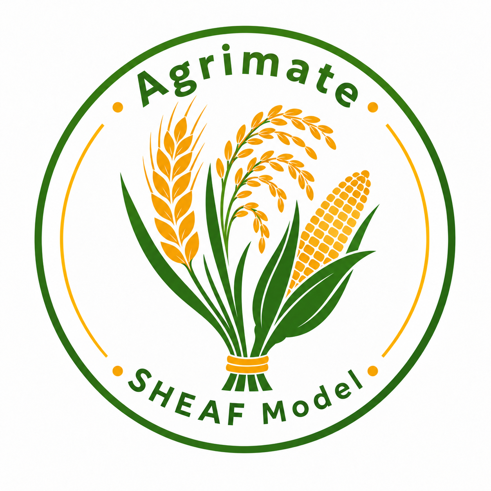
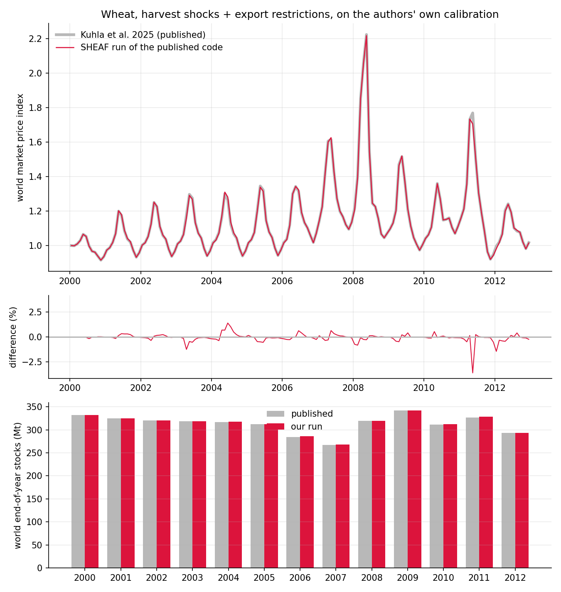

# SHEAF

<p align="center">
  
</p>

> **sheaf** &nbsp;/ʃiːf/&nbsp;
> — *(agriculture)* a bundle of cereal stalks bound together after the harvest;
> — *(mathematics)* a structure that consistently glues locally defined data into a coherent global whole.

**S**ubstitution, **H**eterogeneous agents, **E**quilibrium, **A**nd **F**ragility:
a country-level, multi-commodity, game-theoretic network model of global grain
trade. It sits in the TWIST → Agrimate lineage. Those models already do storage
(and Agrimate already does a trade network). SHEAF exists because two
first-order pieces of crisis dynamics are still missing:

1. **Strategy.** Exporters restrict in a crisis, and those restrictions move
   world prices. Agrimate takes the restriction schedule as given. SHEAF’s
   destination is an *endogenous* export-restriction game among governments.
2. **Substitution.** Wheat, rice, and maize are linked on the demand side.
   Single-commodity models wall each grain off.

Both sit on Agrimate’s **24-step-per-year** market. Gate 0 is both switches
off (AMIS diary, one crop). Gate 1 is substitution on. Gate 2 is the
restriction game (types slow, actions on that same clock;
[`diagnostics/GAME_CLOCK.md`](diagnostics/GAME_CLOCK.md)). Wheat Gate 0 is
**accepted** (G0-P). Rice/maize smoke is next; then substitution.

The Gate 0 host is the **published Julia Agrimate code**, vendored at
[`agrimate_julia/`](agrimate_julia/) (Kuhla, Kubiczek, Puma, and Otto 2025;
Zenodo [10.5281/zenodo.14022004](https://doi.org/10.5281/zenodo.14022004);
CC-BY 4.0). Python here is drivers, input generation, scoring, and plots.

## Gate 0 status

The published code, given the authors’ own calibration, **reproduces their
published wheat run**
([`diagnostics/gate0_julia/J10_authorbaseline.md`](diagnostics/gate0_julia/J10_authorbaseline.md)).
The 2007/08 world-price ratio is 1.359 against their 1.361, 2010/11 is 1.213
against 1.219, the May 2008 peak is 2.216 against 2.223, monthly prices
correlate at 1.000, and end-of-year stocks are within 0.5 % every year
2000–2012.



*Wheat, harvest shocks plus export restrictions, on the authors’ own
calibration. Grey is the published NetCDF; red is our run of the published
code. The authors did not publish their input tables; J10 inverts their
output arrays back into the CSVs the code reads. That is a verification of
the code path. Reconstructing those tables from USDA / FAOSTAT / AMIS (J4,
J8, J9) ran the same code and did **not** reproduce the published
magnitudes — stocks +23 %, 2007/08 ratio 1.25 versus 1.36 — so public-data
reproducibility remains an open limitation.*

Wheat Gate 0 is **accepted** (G0-P, 2026-10-07;
[`diagnostics/DEVELOPMENT.md`](diagnostics/DEVELOPMENT.md)). Next is a rice
and maize smoke on this host, then Gate 1 substitution.

## Cite

Kuhla, K., Kubiczek, P., Puma, M. J., & Otto, C. (2025). Agrimate: a
process-based model of global annual and intra-annual agricultural market
dynamics. *Ecological Economics*, 231, 108546.
https://doi.org/10.1016/j.ecolecon.2025.108546

Source snapshot used here: Kubiczek et al., Zenodo
[10.5281/zenodo.14022004](https://doi.org/10.5281/zenodo.14022004), folder
`agrimate-equal-sales-penalty`, CC-BY 4.0. SHA-256 of the zip is in
[`agrimate_julia/UPSTREAM.md`](agrimate_julia/UPSTREAM.md). Every SHEAF edit
to that source is listed there.

## Layout

```
agrimate_julia/     vendored Agrimate (do not Pkg.update)
drivers/            launch, score, J-series checkers
inputs/             input builders and USDA/FAOSTAT/AMIS readers
  from_paper.py     invert the author NetCDF (J10)
  from_data.py      reconstruct from public data (J4)
  pipelines/        data_usda.py, data_faostat.py
  generated/        written CSVs (gitignored)
plots/              figure scripts
data/               raw USDA / FAOSTAT / AMIS / calendars
diagnostics/gate0_julia/   J0–J10 evidence
```

## Requirements (Mac and Windows)

Python **3.10+** and Julia **1.6.5** only. Do not install a current Julia.
Do not run `Pkg.update()` or `Pkg.resolve()` — `agrimate_julia/Manifest.toml`
pins the package versions that produced the J10 match.

**Julia 1.6.5** (old releases: [julialang.org/downloads/oldreleases](https://julialang.org/downloads/oldreleases/))

| Platform | Installer | How `drivers/run.py` invokes it |
|---|---|---|
| macOS Intel | `julia-1.6.5-mac64.dmg` | `julia --project=agrimate_julia` |
| macOS Apple Silicon | same **Intel** `.dmg`, run under Rosetta | wraps `arch -x86_64` for you |
| Windows 64-bit | `julia-1.6.5-win64.exe` | `julia.exe --project=agrimate_julia` (no Rosetta) |

Point the drivers at the binary if it is not the default Mac path:

```bash
# macOS / Linux / Git Bash
export AGRIMATE_JULIA=/path/to/julia-1.6.5/bin/julia

# Windows PowerShell
$env:AGRIMATE_JULIA="C:\Julia-1.6.5\bin\julia.exe"

# Windows cmd
set AGRIMATE_JULIA=C:\Julia-1.6.5\bin\julia.exe
```

First time only, instantiate the pinned project (this downloads the
Manifest packages; it does not change versions):

```bash
# macOS / Linux / Git Bash
cd agrimate_julia
"$AGRIMATE_JULIA" --project=. -e 'using Pkg; Pkg.instantiate()'

# Windows PowerShell
cd agrimate_julia
& $env:AGRIMATE_JULIA --project=. -e 'using Pkg; Pkg.instantiate()'

# Windows cmd
cd agrimate_julia
"%AGRIMATE_JULIA%" --project=. -e "using Pkg; Pkg.instantiate()"
```

Python deps:

```bash
python -m pip install -r requirements.txt
```

On Windows, `python` / `py` is fine. On all platforms, run the builders
from the repo root so `PYTHONPATH=.` finds `inputs/pipelines/`.

## 1. Input file creation

`simulate()` does not read USDA or FAOSTAT. It reads **seven CSVs** in one
directory. Python writes those files; Julia (`agrimate_julia/src/preprocess.jl`)
turns them into the baseline. Quantities are **thousand tonnes**. The
world-price index is dimensionless and sits near 1.

| CSV (name contains `crop=<wheat\|rice\|maize>`) | What it is |
|---|---|
| `food-balance_baseline=2007-2009_crop=….csv` | Production, consumption, exports, imports per ISO country |
| `trade-flows_baseline=2007-2009_crop=….csv` | Bilateral `Origin, Destination, Trade Flow` |
| `harvest-distributions_crop=….csv` | 365 daily harvest shares (rows sum to 1) |
| `harvest-anomalies_crop=…_source=FAOsince-2005.csv` | Daily anomaly; 0 before 2005 and wherever the trend is 0 |
| `harvest-trends_crop=…_source=FAOsince-2005.csv` | Daily LOWESS trend. Forcing is `1 + anomaly/trend` |
| `parameters_baseline=2007-2009_crop=…_source=empirical.csv` | Country `STU`, `A_d`, `A_c` (see Calibration) |
| `export-restrictions_crop=…_source=2007-2011.csv` | `Exporter, From, To, Value` (fraction of foreign sales cut) |

Default output directory: `inputs/generated/agrimate_input/` (gitignored).
Several crops can share that folder; the crop is in the filename.

### Public-data inputs (portable; wheat, rice, or maize)

This is the builder to use on a new machine. It does **not** reproduce the
published wheat magnitudes (J4/J8/J9). It is a valid Agrimate run on USDA /
FAOSTAT / AMIS.

Sources, all under `data/`:

- USDA PSD country-year (`data/usda_psd/`), baseline mean **2007–2009**
- FAOSTAT E0 trade, window **2006–2007**, each exporter rescaled to its USDA export total
- harvest calendars in `data/crop_calendars/<crop>_harvest_months.csv` (raised cosine over the harvest months)
- AMIS measures, clipped to **2007-01-01 … 2011-12-31**, overlapping rows merged at the **daily max** cut (prohibition/ban 0.95, quota 0.70, tax 0.50; licensing omitted)

The USDA “European Union” row has no member states, so that total is written
on `DEU`; after `AgrimateEU28` aggregation it is the EU-28 total. Region
membership comes from `agrimate_julia/src/regions.jl`. Extra region: Egypt.

```bash
# macOS / Linux / Git Bash (from the repo root)
export PYTHONPATH=.
python inputs/from_data.py --crop wheat
python inputs/from_data.py --crop rice
python inputs/from_data.py --crop maize

# Windows PowerShell
$env:PYTHONPATH="."
python inputs/from_data.py --crop wheat
python inputs/from_data.py --crop rice
python inputs/from_data.py --crop maize

# Windows cmd
set PYTHONPATH=.
python inputs/from_data.py --crop wheat
```

A good check: harvest-distribution rows sum to 1, anomaly/trend cells are
finite (never blank), restriction dates stay inside 2007–2011.

### Author-calibration inputs (wheat only; reproduces J10)

`inputs/from_paper.py` inverts the authors’ published wheat NetCDF back into
those seven CSVs. Nothing is fitted. It needs their output file (Zenodo
data v3 hindcast) and a Julia dump of the baseline arrays
(`inputs/export_baseline_arrays.jl`). The stock scripts still use a local
path to that dump; this is the J10 verification path, not the portable
workflow. Rice and maize author NetCDFs are not in that zip.

## 2. Calibration

Two layers. Do not retune either to the Pink Sheet or to shrink J4/J8/J9.

**A. Country table (the `parameters_*.csv` we write).**
`from_data.py` fills one row per ISO:

| Column | Rule |
|---|---|
| `STU` | ending stocks / consumption (USDA PSD, 2007–2009 mean) |
| `A_d` | `clip(0.05 + 0.4 × imports/consumption, 0.02, 0.9)` |
| `A_c` | income band: 0.15 (USA, Canada, Australia, EU-28, Rest of Europe, Rest of Oceania), 0.25 (Russia, Kazakhstan, Brazil, Argentina, China, Rest of Eastern Asia, Turkey), 0.40 otherwise |

`from_paper.py` instead copies the authors’ regional `ψ`, `A_d*`, `A_c*`
(and the inverted quantity baseline). That is why J10 matches their run.

**B. What Julia does with that table** (`generate_empirical_params` in
`agrimate_julia/src/preprocess.jl`).

`Params` defaults are `ψ = A_d_star = A_c_star = :empirical`, so the code
reads the CSV. It maps `STU → ψ`, `A_d → A_d_star`, `A_c → A_c_star`,
imputes missing values by the regional then global median, and
**consumption-weights** countries up to Agrimate regions. Those regional
values are the ones in the output NetCDF.

Everything else in `Params` (elasticities `σ`, `ε_c`, `α_foreign = 3.2`,
`N_year = 24`, solver tols, …) is the published default. Do not change it
without an `agrimate_julia/UPSTREAM.md` entry.

The rest of initialization is also Agrimate’s, not ours:
`aggregate_areas` and `infer_trade_flows` (diagonal = consumption − imports),
`generate_baseline_harvests`, `apply_cutoffs_to_trade_network` (1% flow
cutoff), `aggregate_export_restrictions` (country cut × that country’s
share of extra-regional exports). New scenarios should keep writing the
seven CSVs and leave those functions alone.

## 3. Run

Default scenario: wheat, baseline 2007–2009, regions AgrimateEU28 + Egypt,
`t_max = 312` (2000–2012). Add `--anomalies` and/or `--restrictions` for
the paper’s harvest-shock and harvest+AMIS runs. `--t-max 0` stops after
Nash initialization (smoke). `--crop rice` / `--crop maize` need the
matching CSVs from step 1.

```bash
# macOS / Linux / Git Bash
export PYTHONPATH=.
export AGRIMATE_JULIA=/path/to/julia-1.6.5/bin/julia   # if not the default
python drivers/run.py --anomalies --restrictions --t-max 312
python drivers/run.py --crop rice --anomalies --restrictions --t-max 0

# Windows PowerShell
$env:PYTHONPATH="."
$env:AGRIMATE_JULIA="C:\Julia-1.6.5\bin\julia.exe"
python drivers/run.py --anomalies --restrictions --t-max 312

# Windows cmd
set PYTHONPATH=.
set AGRIMATE_JULIA=C:\Julia-1.6.5\bin\julia.exe
python drivers/run.py --anomalies --restrictions --t-max 312
```

Optional overrides: `AGRIMATE_INPUT` (CSV directory; default
`inputs/generated/agrimate_input`), `AGRIMATE_OUTPUT` (NetCDF root; default
`agrimate_julia/data`), or `--inputroot` / `--outputroot`.

A full 312-step wheat run is serial (one NLopt solve per producer per
step) and takes on the order of 12–20 hours of awake time, longer through
the 2010–11 window. Keep the machine from sleeping.

```bash
# Score a NetCDF against the author wheat file (J4/J8/J9/J10 metrics)
python drivers/score.py path/to/output.nc

# Figure from the score CSVs
python plots/j10_vs_author.py
```

`drivers/score.py` is wheat-only (it compares to the published wheat
NetCDF). It also needs `AGRIMATE_JULIA` on Windows.

## What this is not

- Do not implement Gate 1 substitution until rice and maize smoke.
  Do not start Gate 2 until Gate 1 is accepted.
- Do not retune Agrimate economics or parameters to the Pink Sheet.
