# Gate 0 flow diagrams

**Companion to** [`GATE0_DISCUSSION.md`](GATE0_DISCUSSION.md).
**Host:** `sheaf/dynamic_crop.py` (`_simulate_window`).
**Status:** pictures of the *current* map and of *options*. Not a rewrite list.

**Figures in the repo:** [`figures/gate0_flows/`](../figures/gate0_flows/).
**Organized writeup:** [`overleaf/gate0_discussion/`](../overleaf/gate0_discussion/)
(four figures, symbols with units, map \(F\) and how it is solved).
The 19 SVGs remain in this folder as a spare atlas; the Overleaf note
does not include them all.

Accent boxes in the option diagrams are what would **change**. Everything
else stays the current fortnight unless the diagram is a different object
(Agrimate NLPs, yearly QP).

---

## 1. Current Gate 0 — one fortnight

Incoming state: last world \(p\), last asks \(q\), stocks \(S\), harvest \(H\).
Outgoing: new \(p\), new \(q\), new \(S\). No inner solve.

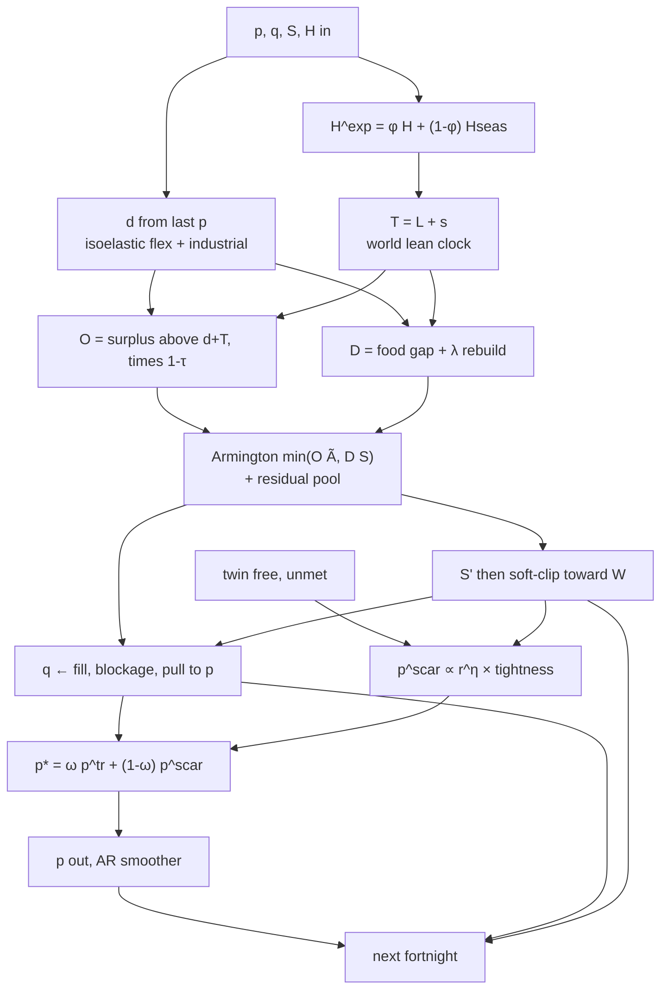

Demand uses **last** step’s \(p\). Twin is a **separate** run of the same
map (climatology harvest, mean flex, no industrial, \(\tau\equiv 0\)).
Calm: twin-match \(\Rightarrow p^\star=p_0\).

---

## 2. Baselines — what feeds that map

Four objects. Scarcity uses the **twin**. \(p_0\) is the numeraire.

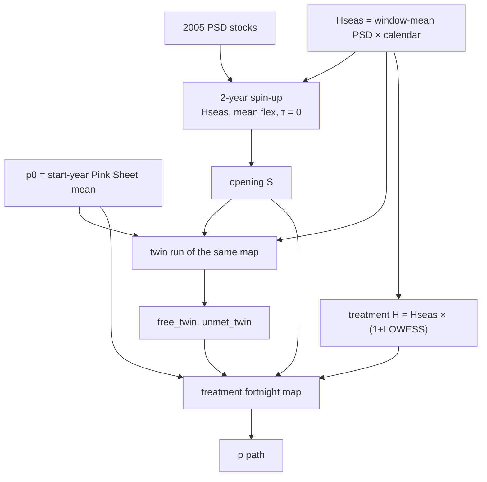

Twin holds \(p=p_0\) so `free_twin` is physical, not a second price path.

### Option B2 — 4-year spin-up

Same diagram; only the spin-up box lengthens (Agrimate ~4 years). Named
sensitivity. Do not retune \(\eta\) to compensate.

### Option B3 — Nash / SPE rest as “baseline”

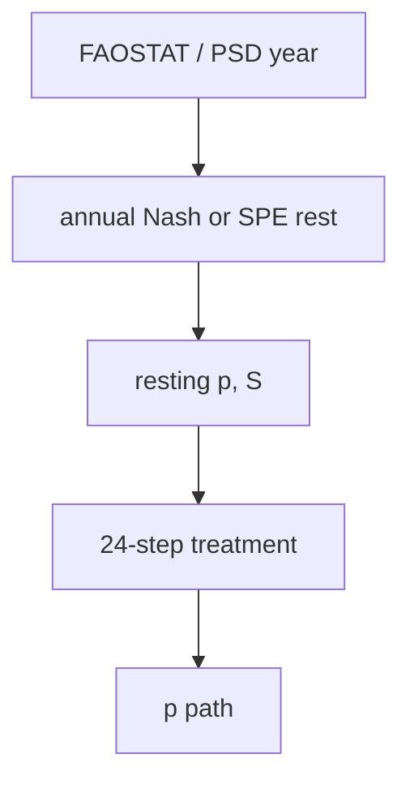

That rest is a **different object** from the current twin (same map, no
shock). It is the parked yearly host, or Agrimate’s periodic Nash — not a
rename of `free_twin`.

---

## 3. Price maps

### P0 — keep the sequential map (current)

Same as §1. \(p\) is not a DE. The ask law is the only piece that looks like
\(\mathrm{d}q/\mathrm{d}t\).

### P2 — same-step consistency

Demand uses **this** step’s \(p\). Dashed edge is a new inner loop
(root-find or one Jacobi step).

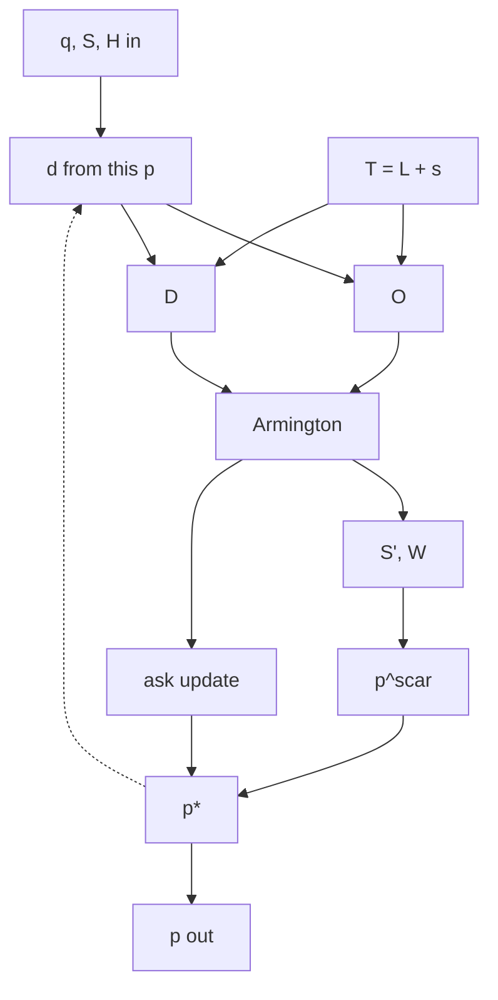

### P3 — ask markup FOC; world \(p\) still inverse-demand flavored

Same as §1 except the ask box becomes an exporter FOC (may collapse
\(\alpha,\theta,\beta\)). World \(p\) still blended.

### P4 — Agrimate-style per-region NLPs (different object)

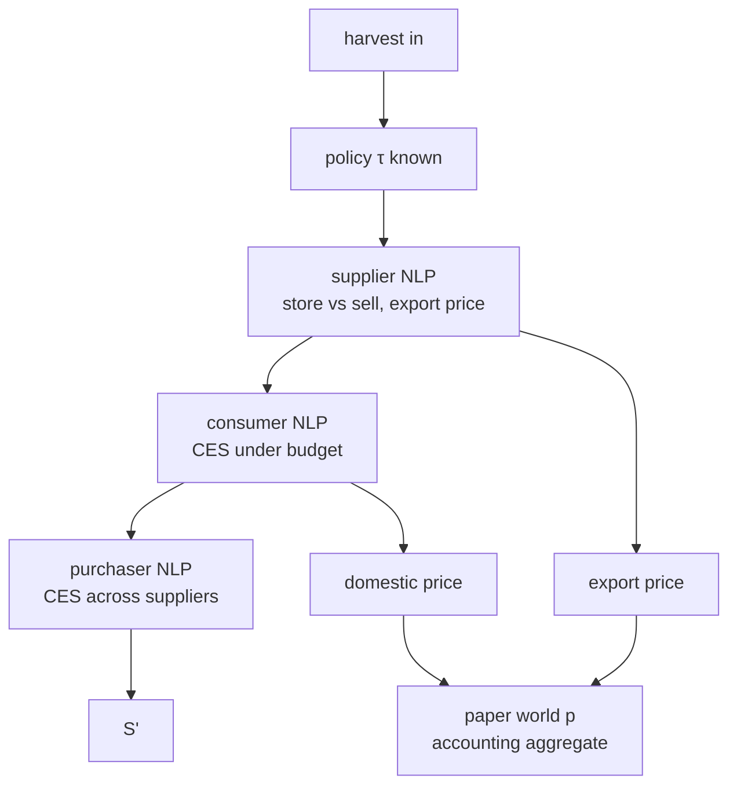

No world \(p\) as a primitive. Do not clone this as Gate 0.

### P5 — yearly SPE as heartbeat (parked host)

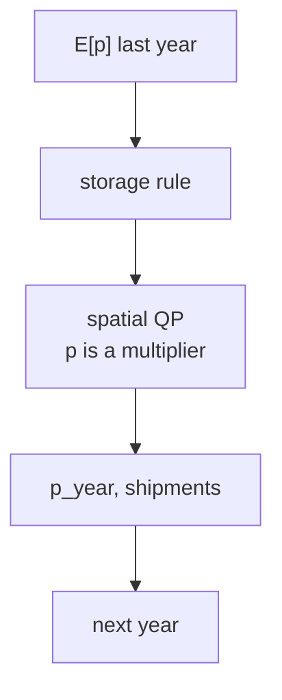

Already failed as the 2007/08 heartbeat. Parked in `sheaf.annual`.

### P6 — continuous DE

Not drawn. Integrating the same reduced-form gains in continuous time
does not add an object.

---

## 4. Optimization principle — what *produces* \(p\)

Three different requests. The boxes that emit \(p\) change; the rest of
the fortnight may not.

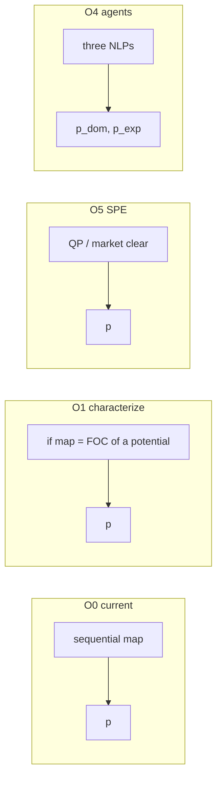

O0/O1 are documentation + math, zero solver. O2 (same-step) and O3 (ask
FOC) reuse §3. O4/O5 are different models.

---

## 5. Storage — how grain is split

### S0 — current cover rule (no agent)

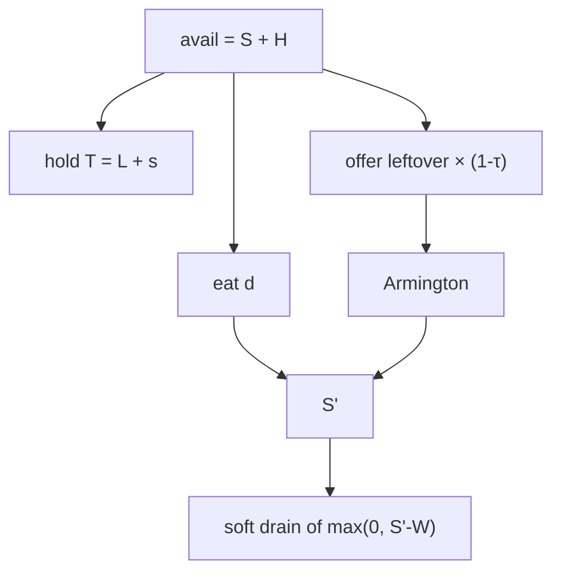

They do not dump this step because \(T\) withholds cover, not because of
an Euler. No carrying cost \(r\).

### S2 — one-line store vs sell

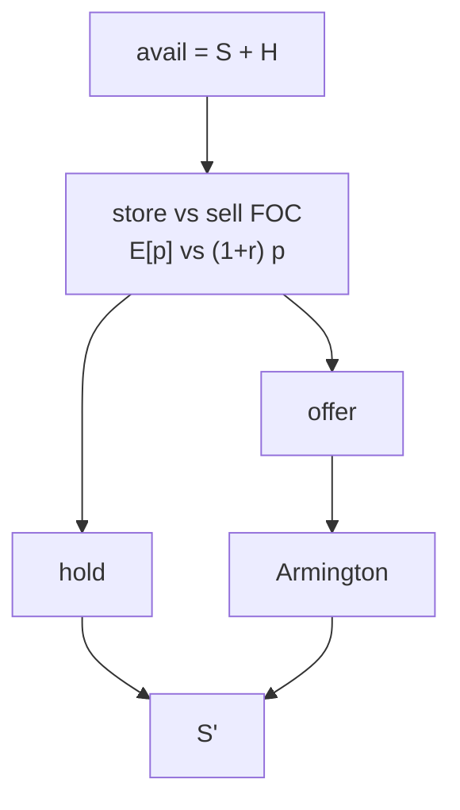

### S4 — Agrimate commercial supplier

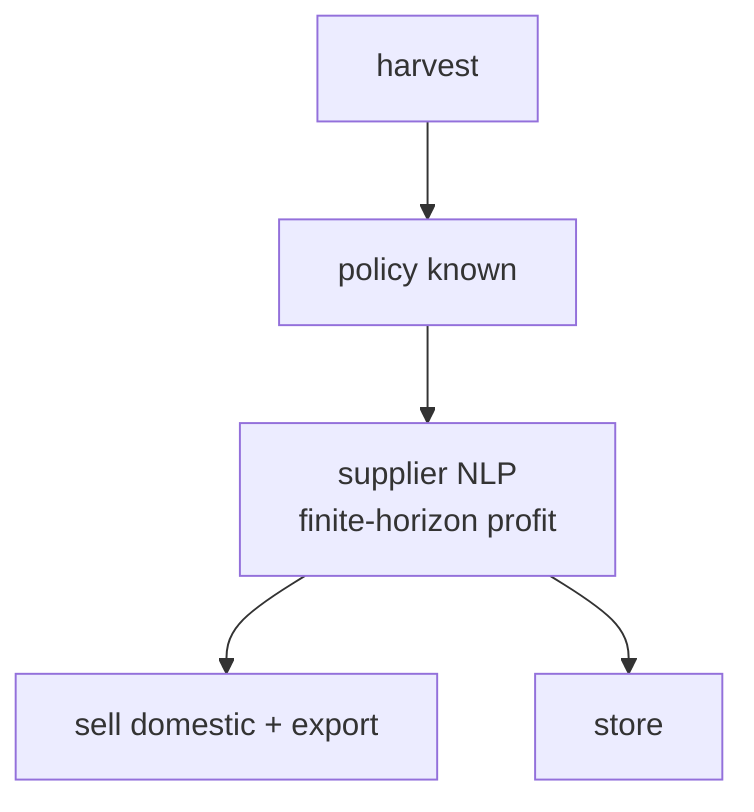

Strategic storage in Agrimate is a **different** agent (partial-adjustment
refill). SHEAF Gate 2 `gov_stu` is not that agent.

Country-specific STU (S3) is not redrawn: tried, rejected (China maize ~×3).
Deaton–Laroque RE (S5) is off the table as a Gate 0 test.

---

## 6. Commercial representation

### Current — rules, not agents

The §1 and §5-S0 diagrams *are* the commercial layer: a partition plus
Armington. Destination mix is \(\tilde A \propto A(p_0/q)^\gamma\), not a
purchaser CES.

### Agrimate — three programs

Same as §3-P4. Purchaser, not the supplier, allocates across markets.

### T1 — domestic vs export price

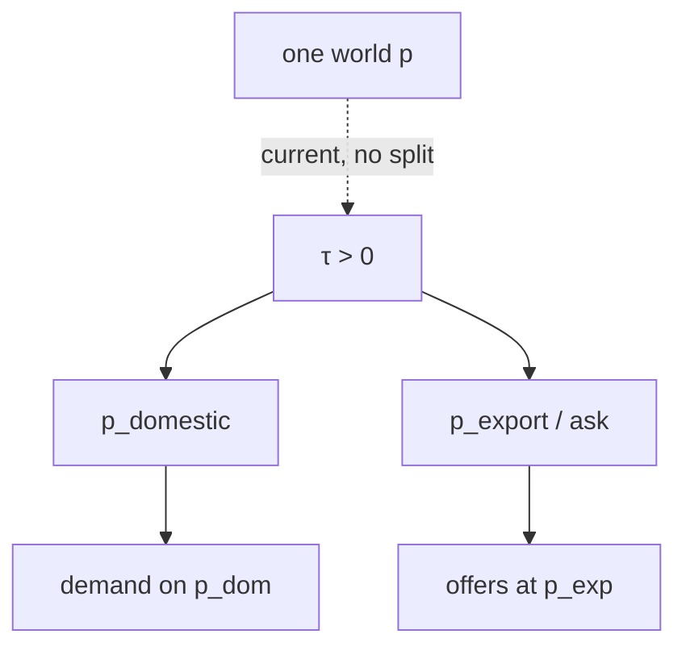

A ban still does not create a cheaper domestic CPI under the current map.
T1 is a later-layer (Gate 2 welfare) option, not a Pink Sheet requirement.

---

## 7. Foresight

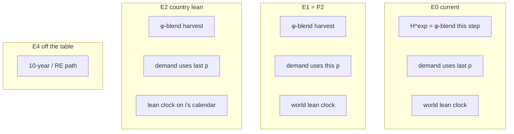

E0 already matches “not 10-year foresight.” E2 is the live modeling
choice (world hungry season vs national crop calendar). E3 waits until
Agrimate’s expectation module is named in their code.

---

## 8. How a diagram becomes a decision

1. Names first (baseline objects, offer vs ask vs \(p\)).
2. If the option diagram is the **same boxes** with an honest label, that
   is keep + writeup (P0, S0, O0).
3. If a **dashed inner edge** or **FOC box** appears, that is a named
   sensitivity (P2, P3, S2) — characterize the current law first.
4. If the diagram is a **different object** (P4, P5, S4), it is not Gate 0
   unless we explicitly replace the host.

Discussion order stays: names → honesty → storage principle → price
principle → knob isolations. See [`GATE0_DISCUSSION.md`](GATE0_DISCUSSION.md) §13.
